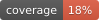

# Synthetic Stellar Pop Convolve (SSPC)
 

This repository contains the code and documentation for the synthetic
stellar-population convolution code-base `Synthetic Stellar Pop Convolve
(SSPC)`. `SSPC` is available in a [Gitlab
repository](https://gitlab.com/dhendriks/syntheticstellarpopconvolve) as well
as on [Pypi](https://pypi.org/project/syntheticstellarpopconvolve/).

## **Overview**
**SSPC** (*Synthetic Stellar Pop Convolve*) is a Python package designed to convolve
stellar population synthesis outputs with star formation histories, enabling
detailed predictions of astrophysical event rates over cosmic time. By
integrating synthetic stellar and binary evolution models with cosmological
and observational constraints, SSPC helps generate realistic event
distributions.

The code was originally developed by [David
Hendriks](https://www.davidhendriks.com/) (with invaluable help from [Lieke
van Son](https://liekevanson.github.io/)) for the project of [Hendriks et al.
2023 (MNRAS)](https://doi.org/10.1093/mnras/stad2857), where it was used to
convolve gravitational-wave merger events from binary systems as well as
supernova events from both binary systems and single stars with a cosmological
star-formation rate.

SSPC can be used to convolve the pre-calculated output of stellar
population-synthesis codes with (cosmological) starformation rates, as well as
on-the-fly population-synthesis simulation and convolution. It can convolve
both event-based (line by line) data, as well as ensemble-based (nested
histogram/pre-binned) data, either by integration or by generating samples
from the convolution results.

### **Main Purpose**
The core goal of SSPC is to **compute astrophysical event rates** (e.g.,
supernovae, compact object mergers, nucleosynthetic yields) by integrating
stellar population synthesis outputs with **(cosmological) star formation rate
(SFR) models**.

SSPC is particularly useful for:
- **Gravitational-wave astrophysics** (binary black hole/neutron star mergers).
- **Supernova rate predictions** for different stellar environments.
- **Galaxy chemical evolution modeling**, linking nucleosynthetic yields to cosmic star formation.
- **Transient event forecasts**, such as tidal disruption events, gamma-ray bursts, and luminous red novae.
- **Generalized stellar population modeling**, providing insight into the evolution of stellar populations over cosmic time.

## **Features**
SSPC provides a robust framework for convolving stellar population synthesis data with star formation rates. Its key features include:

✅ **Event-based convolution**: Handles transient data.
✅ **Ensemble-based convolution**: Handles nested histograms and binned data.
✅ **Convolution by integration**: Handles convolution by summing the normalized yields with the star formation rates to get the actual yield.
✅ **Convolution by sampling**: Generates actual sampled systems from the actual yield.
✅ **Supports different SFR prescriptions**: Users can apply arbitrary star formation rate models.
✅ **Flexible star formation modeling**: Supports sequential convolution with multiple SFRs.
✅ **Convolution instructions**: Supports sequential convolution of multiple **convolution instructions**.
✅ **Multiprocessing and sequential convolution support**: Uses multiprocessing when each convolution target time is independent, but can use sequential convolution when the next step depends on the previous one.
✅ **Astropy support**: Uses Astropy units to perform unit checks and dimensional analysis of yields.
✅ **Post-convolution processing**: Allows user-provided **post-convolution** functions to refine results (e.g., LISA frequency range selection), re-weighting based on detection probability, and

Planned features:
- **Chunked convolution** for large datasets that don’t fit into memory.
- **Better support for spatially resolved star-formation rates**.
- **Support for star formation using generators** for use-cases where the previous convolution time affects the star formation of the next convolution time.


---

## **Usage**

Using SSPC is designed to be simple, and only requires the following ingredients
- **input data**: pre-calculated population-synthesis results which contain at least delay time information and a normalized yield value
- **starformation rate model**: a dictionairy-type containing information about the rate of star formation and the corresponding times, and optionally information about metallicity distributions.
- **data-column dict**: a dictionary that allows SSPC to fetch the relevant data columns, optionally with units and value conversions.
- **general configuration**: a global configuration.
- **convolution instruction**: instructions for a particular convolution.

### **Quick Start Guide**

Here’s a minimal example demonstrating how to use SSPC:

```python
import syntheticstellarpopconvolve as sspc
from astropy import units as u
import numpy as np

# Example star formation rate dictionary
sfr_dict = {
    "lookback_time_bin_edges": np.arange(0, 10, 1) * u.Gyr,
    "starformation_rate_array": np.ones(9) * u.Msun / u.yr,
}

# Example event data
event_data = {
    "delay_time": np.array([0.5, 1.2, 3.7]) * u.Gyr,
    "normalized_yield": np.array([1.0, 0.8, 0.5]),
}

# Perform convolution
result = sspc.convolve()

# Print results
print(result)
```

This example demonstrates how to:
- Define a **star formation history**.
- Provide **event-based** input data.
- Perform a **convolution** to obtain astrophysical predictions.

For more detailed examples, check out the **tutorial notebooks**:
📖 **[Example Notebooks](https://synthetic-stellar-pop-convolve.readthedocs.io/en/latest/example_notebooks.html)**


---

## **Installation**

### **Requirements**
SSPC relies on several Python dependencies, listed in `requirements.txt`. These are automatically installed via `pip` or `setup.py`.

### **Install via PyPI**
To install the latest release:
```bash
pip install syntheticstellarpopconvolve
```

### **Install from Source**
If you need the **development version**, clone the repository and run:
```bash
git clone https://gitlab.com/dhendriks/syntheticstellarpopconvolve.git
cd syntheticstellarpopconvolve
./install.sh
```

This ensures all dependencies are installed into your active virtual environment.

---

## **Documentation**
Comprehensive documentation is available on **ReadTheDocs**:
📚 [SSPC Documentation](https://synthetic-stellar-pop-convolve.readthedocs.io/en/latest/), including [tutorial and example use-case notebooks](https://synthetic-stellar-pop-convolve.readthedocs.io/en/latest/example_notebooks.html)

---

## **Development & Contributions**
We welcome contributions! If you're interested in contributing:

1. Install development dependencies:
   ```bash
   pip install -r development_requirements.txt
   ```
2. Read the **HOW_TO_CONTRIBUTE** guide.
3. Submit bug reports or feature requests via **GitLab Issues**.

**Naming conventions for branches:**
```
development/<SSPC version>
releases/<SSPC version>
```

---

## **Generating Reports & Documentation**
Run the following commands from the `commands/` directory:

📖 **Generate documentation**:
```bash
./generate_docs.sh
```
📊 **Generate docstring & test coverage reports**:
```bash
./generate_reports.sh
```

---

## **Community & Support**
If you have questions or suggestions, feel free to reach out via:
- **Email**: [mail@davidhendriks.com](mailto:mail@davidhendriks.com)

Help improve SSPC by reporting issues and suggesting new features!

---

### **License**
SSPC is released under the **MIT License**. See [LICENSE](LICENSE) for details.
